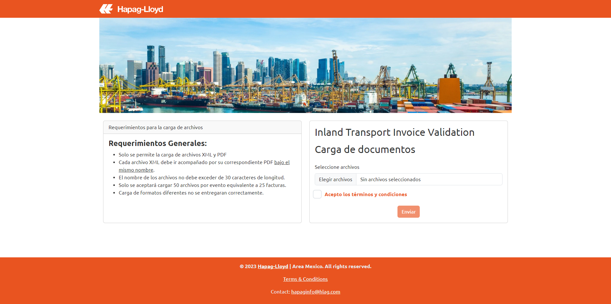
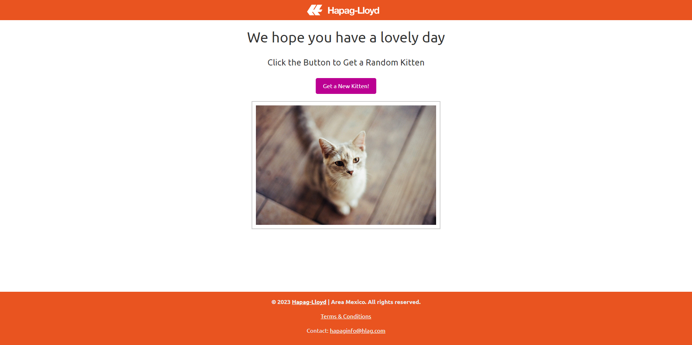

# Bill Validator App for HG

**This is an Early Development Branch**

This repository contains an early development version of the app. Please note that this is not the official release 

## Overview

Flask-based web application that validates PDF and XML documents for different bills. Users can upload their bills, and the app will perform the validation.

## App Validation

- Validates PDF and XML documents for bills.
- Requires a corresponding PDF for each XML file.
- Limits file names to 30 characters in length.
- Allows the upload of up to 50 files per event, equivalent to 25 bills.
- Ensures that only XML and PDF file formats are accepted for upload.

## Features

### The Cat API - Cats as a Service. 

The Cat API Screen, I was at the office working on this project and I decided to add the Cat API to have fun with my Team and as far as I know this screen still on the official production server...

## Requirements

- pip install virtualenv (create and activate virtualenv)
- pip install -r requirements.txt
- python app.py

### General Requirements:

- **File Types:** The app only accepts XML and PDF file formats.
- **File Pairing:** Each XML file must be accompanied by its corresponding PDF under the same name.
- **File Name Length:** File names should not exceed 30 characters in length.
- **File Limit:** A maximum of 50 files can be uploaded per event, equivalent to 25 bills.
- **Different Formats:** Uploading different formats will not result in successful validation.

## Technologies Used

- Flask
- Bootstrap

## Contact

For questions or to connect, you can also visit [my LinkedIn profile](https://www.linkedin.com/in/miranda10am/).
